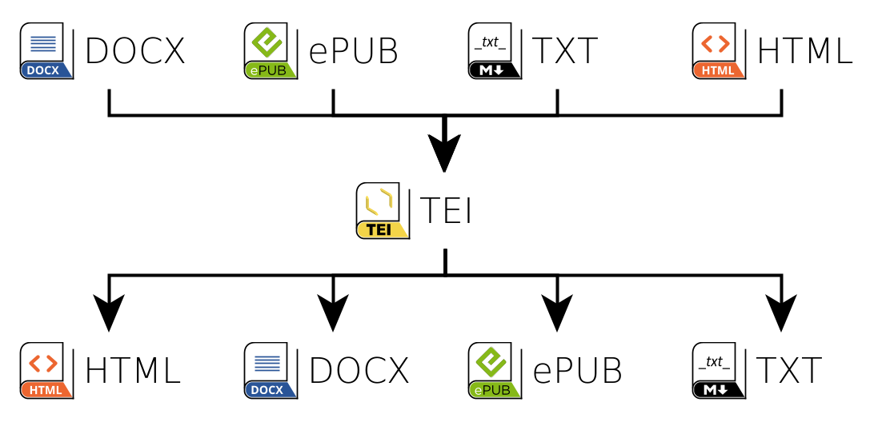

# [teinte_convert](https://github.com/oeuvres/teinte_convert), TEI shades, convert your text files

Teinte_convert is an <a target="_blank" href="https://github.com/oeuvres/teinte_convert">open source</a> application to convert texts files.
You can find the always up to date installation on <a target="_blank" href="https://fictif.oirg/teinte">fictif.org/teinte</a> (a standard commercial hosting).
This converter is a demo for the <a target="_blank" href="https://packagist.org/packages/oeuvres/teinte">oeuvres/teinte</a> composer package.
Try it with all your odd files. Maybe you will not be happy, send a mail to  <a onmouseover="this.href='mailto'+'\x3A'+'frederic.glorieux'+'\x40'+'fictif.org'" href="#">Frédéric Glorieux</a>, 
or <a target="_blank" href="https://github.com/oeuvres/teinte_php/issues">fill an issue</a> (sadly, identification is required). All your angers, bugs or requirements could be useful for others, feel free to post them.

